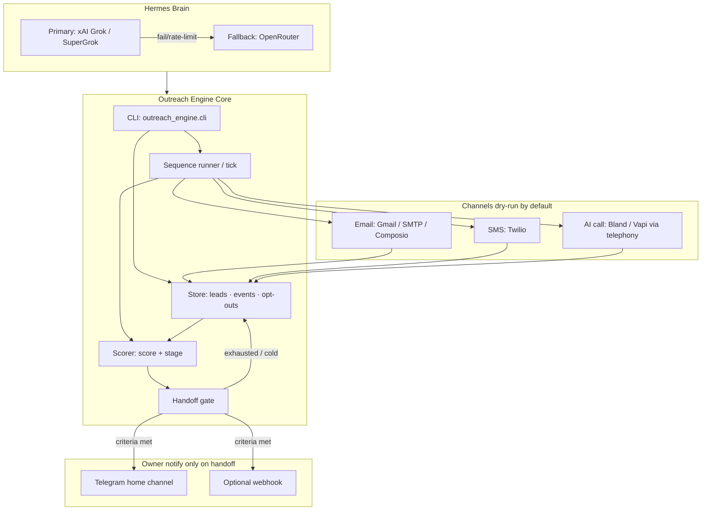

# Outreach Engine Architecture

## System diagram (Mermaid)



## ASCII diagram (fallback)

```
                    ┌─────────────────────────────┐
                    │     Hermes Agent (brain)    │
                    │  Grok/xAI  →  OpenRouter    │
                    └──────────────┬──────────────┘
                                   │
                    ┌──────────────▼──────────────┐
                    │   outreach_engine.cli       │
                    │   demo | tick | send | ...  │
                    └──────────────┬──────────────┘
                                   │
          ┌────────────────────────┼────────────────────────┐
          │                        │                        │
          ▼                        ▼                        ▼
   ┌─────────────┐         ┌─────────────┐         ┌──────────────┐
   │   Store     │◄───────▶│   Scorer    │────────▶│ Handoff gate │
   │ leads/events│         │ score/stage │         │ criteria?    │
   └──────▲──────┘         └─────────────┘         └──────┬───────┘
          │                                               │
          │         ┌──────────┬──────────┐               │
          │         │          │          │               │
          │         ▼          ▼          ▼               ▼
          │      Email       SMS      AI call      Telegram/webhook
          │     SMTP/Gmail  Twilio   Bland/Vapi     (owner only)
          │         │          │          │
          └─────────┴──────────┴──────────┘
                    touch log (dry_run | live)
```

## Component contracts

### Brain
- **Primary:** xAI Grok (SuperGrok / high-tier preferred for long-running agent loops)
- **Fallback:** OpenRouter (e.g. Claude Sonnet class)
- **Job:** decide next touch, personalize within templates, classify reply intent, apply handoff rules — not to spam or close deals alone

### Store
Minimum fields per lead:

| Field | Purpose |
|-------|---------|
| `id` | Stable lead id |
| `name`, `email`, `phone` | Channels |
| `source` | e.g. `crypto-discord-demo` |
| `score`, `stage` | scorer outputs |
| `sequence_id`, `step_index` | cadence state |
| `opted_out` | hard suppress |
| `last_touch_at`, `events[]` | audit trail |

### Scorer
- Inputs: opens, clicks, replies, call outcomes, explicit intents
- Outputs: integer score + stage enum: `cold | warm | hot | qualified | exhausted | opted_out`
- Default handoff: score ≥ 40 **or** stage in `{hot, qualified}` **or** interested reply **or** pricing/demo/booked-call signal

### Channels
| Channel | Implementation | Live gate |
|---------|----------------|-----------|
| Email | Gmail SMTP or Composio Gmail | `--live` + owner confirm + not dry_run |
| SMS | Twilio | same + STOP honored |
| Voice | Bland/Vapi via `telephony` skill | same + consent notes |

All channels in dry-run write a **payload preview** to the touch log and return success without provider send.

### Notify
- Fire **once per handoff transition** (debounce re-alerts)
- Channels: Telegram (`TELEGRAM_BOT_TOKEN` + `TELEGRAM_HANDOFF_CHAT_ID`) and/or `HANDOFF_WEBHOOK_URL`
- Demo labels: prefix `[DEMO]` when `DRY_RUN=true`

## Data flow (single tick)

1. `tick` loads due enrollments from store
2. For each due step: render template → channel adapter (`dry_run` or `live`)
3. Record event; scorer updates score/stage
4. If handoff criteria newly met → notify owner once
5. If sequence complete with no handoff → mark `exhausted`, log only

## Runtime layout (target)

```
/opt/data/repos/hermes-outreach-engine/
  src/outreach_engine/
    cli.py
    store.py
    scorer.py
    sequences/
    channels/
    notify.py
  config/
  data/runtime/          # gitignored
  skills/outreach-engine/
  .env.example
```

## Env surface

See repo `.env.example`:

- `DRY_RUN=true` (default)
- Model keys: `XAI_API_KEY`, `OPENROUTER_API_KEY`
- Email SMTP_* / Composio
- Twilio + Bland/Vapi
- Telegram / webhook handoff

## Trust boundaries

- Engine may message **leads** only through channel adapters
- Engine may message **owner** only via handoff notify
- Secrets never in git; skill never prints full API keys
- LIVE is an explicit privilege, not a default
